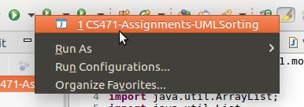

# CS471-Assignments-UMLSorting
This Java GUI application visualizes various sorting algorithms.

## Building and Running
This repository is an Eclipse project and should be easily imported and build within the [Eclipse Oxygen IDE](https://www.eclipse.org/oxygen/).

The project is configured to use [Java 8](http://www.oracle.com/technetwork/java/javase/overview/java8-2100321.html).

### 1. Get the Code
Clone this repository to your local computer in the folder `<CS471-Assignments-UMLSorting>`.

### 2. Import the Project into Eclipse
 * Open Eclipse
 * From the main menu bar, select `File > Import...` to open the import wizard (see below).

 

 * Select the directory you created when cloning the code in Step 1 (i.e., `<CS471-Assignments-UMLSorting>`).
 * Click `Finish`
 
Refer to the offical Eclipse [help documentation](http://help.eclipse.org/oxygen/index.jsp?topic=%2Forg.eclipse.platform.doc.user%2Ftasks%2Ftasks-importproject.htm) for more details about importing a project into Eclipse.

### 3. Build
If you do not have Eclipse configured to automatically build projects, then use the menu option `Project > Build Project` to build it.

### 4. Run
A [run configuration](./CS471-Assignments-UMLSorting.launch) is included. It allows you to use the use the toolbar to launch the program.


Click the dropdown on the toolbar to click the configuration to launch the program.



## Documentation
### JavaDoc
You can build the JavaDoc using complicated options in Eclipse, or simply run the provided ant script ([javadoc.xml](./javadoc.xml)) using:
```bash
ant -f javadoc.xml
```
This command creates the documentation in `<CS471-Assignments-UMLSorting>/doc/javadoc/`. To view the documentation, open the following file in a browser:
    `<CS471-Assignments-UMLSorting>/doc/javadoc/index.html`
    
### Sequence Diagrams
See the [sequence diagram README](./doc/sequence-diagrams/README.md) for examples and instructions for creating sequence diagrams.
